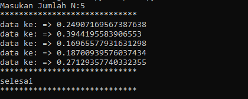
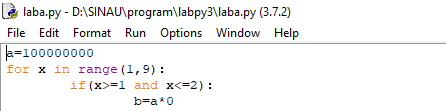

# Penjelasan alur algoritma

# Latihan 1

# Import

menggabungkan dua operasi; itu mencari modul yang bernama, kemudian mengikat hasil pencarian itu ke nama di lingkup lokal.
Operasi pencarian importpernyataan didefinisikan sebagai panggilan ke import()fungsi, dengan argumen yang sesuai.
Nilai kembali dari import()digunakan untuk melakukan operasi pengikatan nama import pernyataan.
Lihat importpernyataan untuk detail persis operasi pengikatan nama itu.

# For

Jika urutan berisi daftar ekspresi, itu dievaluasi terlebih dahulu. Kemudian, item pertama dalam urutan ditugaskan ke variabel iterating iterating_var .
Selanjutnya, blok pernyataan dieksekusi. Setiap item dalam daftar ditugaskan ke iterating_var , dan blok pernyataan dieksekusi sampai seluruh urutan habis.

# Variabel i

Variabel i berfungsi untuk menampung indeks, dan fungsi range() berfungsi untuk membuat list dengan range dari 0-10.
Fungsi str() berfungsi merubah tipe data ineger ke string.

# Print

Untuk menampilkan objek ke perangkat pengeluaran.

# Hasil Program Jika Di Jalankan

# Latihan 2

# Print

Untuk menampilkan objek ke perangkat pengeluaran.

Hasil Program Jika DI Jalankan

# While

Pertama menentukan variabel untuk menghitung, dan menentukan kapan perulangan berhenti. kalau pengguna menjawab tidak maka perulangan akan terhenti.

jawab = 'ya' hitung = 0

Melakukan perulangan dengan while, kemudian menambah satu variabel hitung setiap kali mengulang. lalu menanyakan kepada pengguna, apakah mau berhenti mengulang atau tidak?

while(jawab == 'ya'): hitung += 1 jawab = raw_input("Ulang lagi tidak? ") Setelah selesai mengulang, cetak berapa kali perulangan tersebut terjadi

# Jika Di Jalankan 

# Program1

# Varibel a

# For

Jika urutan berisi daftar ekspresi, itu dievaluasi terlebih dahulu. 
Kemudian, item pertama dalam urutan ditugaskan ke variabel iterating iterating_var . Selanjutnya, blok pernyataan dieksekusi. 
Setiap item dalam daftar ditugaskan ke iterating_var , dan blok pernyataan dieksekusi sampai seluruh urutan habis.

# If

# Print

Untuk menampilkan objek ke perangkat pengeluaran.

# Jika Di Jalankan

